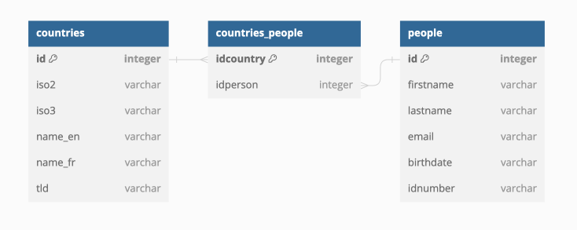

# HelloDojo Marketing

Ce fichier permet de consigner et documenter les étapes que vous avez suivies
pour répondre aux demandes du [README.md](README.md).

<!-- 
Note: de manière générale vous devez remplacer toutes les requêtes SQL,
les `XXX`, `NUMBER`, `TEXT` ou `NAME`.
-->

## Mise en place

<!-- 
Vous devez expliquer ici quelle solution technique vous avez choisie, comment
il faut procéder pour l'installer, quelles sont les commandes ou les étapes à
suivre pour importer les tables, quel outil vous avez utilisé pour créer le
schéma entité-relation de la base, et toutes autres informations qui pourraient
vous sembler utiles dans le but qu'une autre personne puisse **reproduire** 
votre démarche.
-->

Voici les étapes que j'ai suivies pour installer un docker, créer une base de données
et y importer les tables :
  1. j'ai créé un docker file qui n'a qu'une simple db MariaDB, avec les ports 3306 ouverts pour s'y connecter avec un client;
  1. j'ai paramétré les volumes pour qu'un dossier "MyMariaDB" soit créé et contienne la db. La db se créée automatiquement grâce au ```shell /docker-entrypoint-initdb.d```. Cela prend les fichiers .sql qui sont dans le dossier "sql";
  1. il ne reste plus qu'à faire un simple ```shell docker compose up -d``` pour créer le docker.

J'ai choisi d'utiliser DBeaver comme client de base de données.

J'ai généré le schéma avec https://dbdiagram.io/d:



## Informations à récolter

### Générales

1. La table `people` contient 410 personnes, ma requête est :  
  ```sql
  SELECT * FROM people;
  ```
1. Cette requête permet de trouver l'email de la personne dont le nom de
   famille est "Warren" :
  ```sql
  SELECT email FROM people WHERE lastname LIKE "%warren%";
  ```
1. La table `people` est triée par nom de famille en ordre croissant, ma requête 
   est :  
  ```sql
  SELECT * FROM people ORDER BY lastname ASC;;
  ```
1. Les 5 premières entrées de la table `people` triée par nom de famille en 
   ordre croissant sont :  
  ```sql
  SELECT * FROM people ORDER BY lastname ASC LIMIT 5;
  ```
1. Je trouve toutes les personnes dont le nom ou le prénom contient `ojo`, ma  
   requête est :  
  ```sql
  SELECT * FROM people WHERE lastname LIKE "%ojo%";
  ```
1. Les 5 personnes les plus jeunes sont obtenues avec cette requête :  
  ```sql
  SELECT * FROM people ORDER BY birthdate DESC LIMIT 5;
  ```
1. Les 5 personnes les plus agées sont obtenues avec cette requête :  
  ```sql
  SELECT * FROM people ORDER BY birthdate ASC LIMIT 5;
  ```
1. La requête suivante permet de trouver l'age (en année) de chaque personne :  
  ```sql
  SELECT *, (YEAR(NOW()) - YEAR(birthdate)) as age FROM people;
  ```
1. La moyenne d'age (en année) est `29`, ma requête est :  
  ```sql
  SELECT AVG(YEAR(NOW())-YEAR(birthdate)) as Average from people;
  ```
1. Le prénom le plus long est `Clementine`, ma requête est :  
  ```sql
  SELECT firstname FROM people ORDER BY LENGTH(firstname) DESC LIMIT 1;
  ```
1. Le nom de famille le plus long est `Christensen`, ma requête est:  
  ```sql
  SELECT lastname FROM people ORDER BY LENGTH(lastname) DESC LIMIT 1;
  ```
1. La plus longue paire "nom + prénom" est `Cheyenne Pennington`, ma requête est :  
  ```sql
  SELECT firstname, lastname FROM people ORDER BY (LENGTH(firstname) + LENGTH(lastname)) DESC LIMIT 1;
  ```
1. La table `people` contient `10` doublons, ma requête est :  
  ```sql
  SELECT firstname, lastname, COUNT(*) FROM people GROUP BY firstname, lastname HAVING COUNT(*) > 1;
  ```

### Invitations

1. Pour lister tous les membres de plus de 18 ans :  
  ```sql
  SELECT *, (YEAR(NOW()) - YEAR(birthdate)) as age FROM people WHERE (YEAR(NOW()) - YEAR(birthdate)) >= 18 ORDER BY age;
  ```
1. Pour lister tous les membres de plus de 18 ans et de moins de 60 ans :  
  ```sql
  SELECT somecolumns FROM sometable [...];
  ```
1. Pour lister tous les membres de plus de 18 ans, de moins de 60 ans et qui 
   une addresse email valide :  
  ```sql
  SELECT somecolumns FROM sometable [...];
  ```
1. Pour ajoutez une colonne `age` dans le résultat de la requête :  
  ```sql
  SELECT somecolumns FROM sometable [...];
  ```
1. Pour générer un champs contenant `Prénom Nom <email@provider.com>;` :  
  ```sql
  SELECT somecolumns FROM sometable [...];
  ```
1. Avec cette requête :  
  ```sql
  SELECT somecolumns FROM sometable [...];
  ```  
  je peux estimer que `NUMBER` personnes habitent en Suisse.

### Countries

1. La requête qui permet d'obtenir la liste d'options sous la forme :  
   `<option value="XXX">XXX</option>` est :  
  ```sql
  SELECT somecolumns FROM sometable [...];
  ```
1. Pour avoir la liste d'options en plusieurs langues, je procède de la manière 
   suivante :  
  ```sql
  SELECT somecolumns FROM sometable [...];
  ```

### Jointure

1. Avec cette requête :  
  ```sql
  SELECT somecolumns FROM sometable [...];
  ```    
   je sais que `NUMBER` personnes habitent en Suisse.
1. Avec cette requête :  
  ```sql
  SELECT somecolumns FROM sometable [...];
  ```  
   je sais que `NUMBER` personnes n'habitent pas en Suisse.
1. Avec cette requête :  
  ```sql
  SELECT somecolumns FROM sometable [...];
  ```  
  je liste (nom & prénom) les membres habitants de France, Allemagne, Italie,   Autriche et Lischenchtein.
1. Cette requête :  
  ```sql
  SELECT somecolumns FROM sometable [...];
  ```  
   permet de compter combien il y a de personnes par pays.
1. Cette requête :  
  ```sql
  SELECT somecolumns FROM sometable [...];
  ```  
  liste les pays qui ne possèdent pas de personnes.
1. En exécutant cette requête :  
  ```sql
  SELECT somecolumns FROM sometable [...];
  ```  
   je sais que `NAME`, `NAME` et `NAME` sont liés à plusieurs pays.
1. En exécutant cette requête :  
  ```sql
  SELECT somecolumns FROM sometable [...];
  ```  
  je sais que `TEXT` parce que `TEXT`.
1. De la manière suivante :  
  ```sql
  SELECT somecolumns FROM sometable [...];
  ```  
  nous pouvons afficher le pourcentage de personnes par pays.


### Procédures

1. Cette requête permet d'extraire le `tld` de l'adresse email et de le lier à la table `countries` :  
  ```sql
  SELECT somecolumns FROM sometable [...];
  ```  
1. Pour ajouter une chaine si la jointure ne retourne rien, j'ai procédé de la manière suivante :  
  `STRING`
1. Avec `STRING`, nous pouvons partager le mécanisme qui extrait le `tld`.
  ```sql
  SELECT somecolumns FROM sometable [...];
  ```

### Vue SQL

1. J'ai créé une vue bien pratique contenant toutes les infomrations utiles à un humain. Ma requête est:  
  ```sql
  CREATE viewsomething as somequery [...];
  ```  
1. Je peux exporter ma vue au format CSV avec la requête :
  ```sql
  SELECT somecolumns FROM sometable [...];
  ```

### Finances

1. J'ai créé une table pour les finances. Ma requête est:  
  ```sql
  CREATE sometable [...];
  ```
1. J'ai ajouté des données de test avec la reuêtes SQL suivante :  
   ```sql
   INSERT INTO expenses [...];
   ```
1. J'ai modifié la vue en y ajoutant les finances. Ma requête est:  
  ```sql
  UPDATE someview [...];
  ```

### Intégrité référentielle
(WIP)
1. Pour ajouter les clés étrangères, j'ai utilisé les requêtes suivantes :  
  ```sql
  ALTER sometable [...];
  ALTER sometable [...];
  ```
1. J'ai du modifier les données de la table `NAME` parce que XXX.
